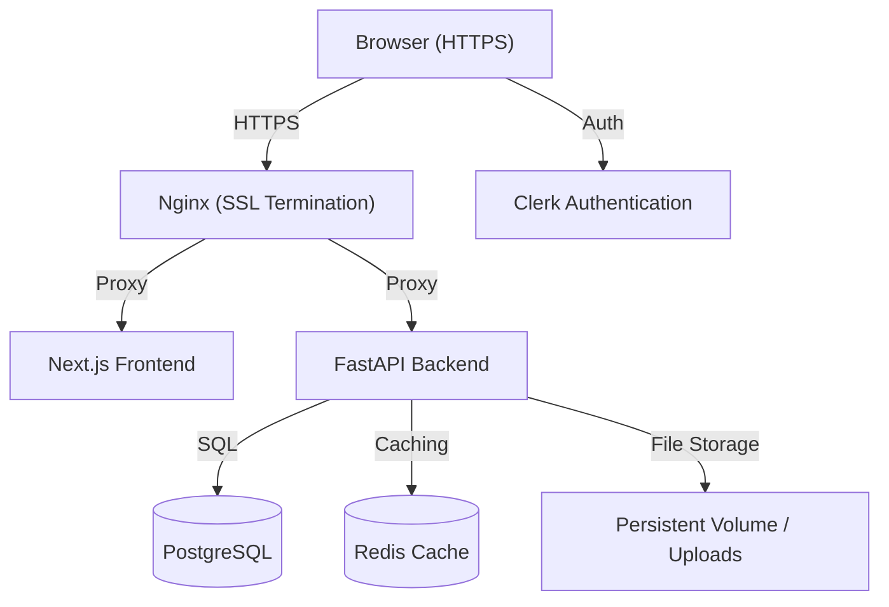
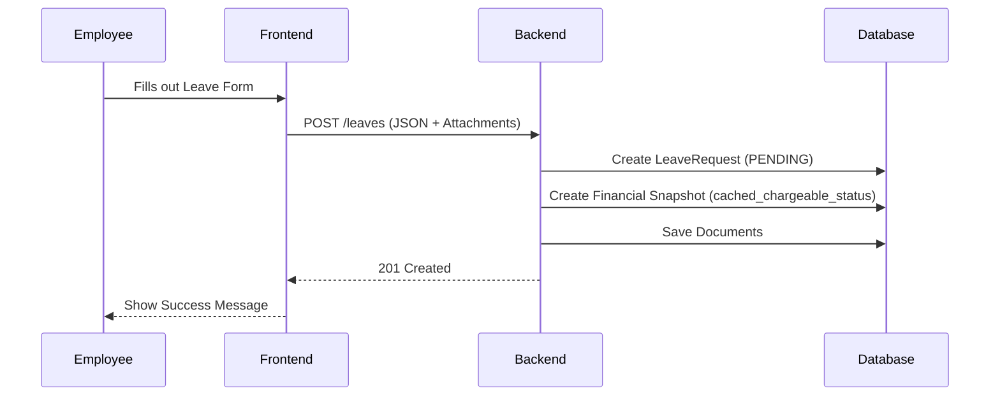
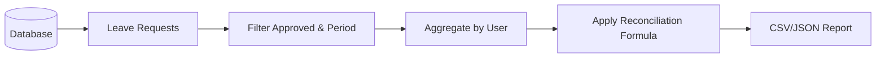

# System Architecture & Design

This document details the technical implementation of Leavey.

## System Overview

Leavey follows a standard 3-tier architecture with a decoupled frontend and backend.



### Components

- **Reverse Proxy**: Nginx handles SSL termination, redirects HTTP to HTTPS, and routes traffic to the frontend and backend.
- **Frontend**: A Next.js application providing a responsive user interface.
- **Backend**: A FastAPI server handling business logic and API requests.
- **Database**: PostgreSQL serves as the primary data store.
- **Authentication**: Clerk manages identities; Nginx forwards headers to enable backend validation.
- **File Storage**: Local volumes for uploads.

## Data Flow Diagrams

### Leave Request Submission Workflow



### Reconciliation Data Flow



## Reconciliation Logic

The reconciliation engine is the core financial component of Leavey. It calculates the billable days for contractors based on their approved leave and the "chargeable" status of those leaves.

> [!TIP]
> For a detailed breakdown of the math, snapshotting mechanism, and edge cases, see the **[Reconciliation Deep Dive](reconciliation.md)**.

### The Formula

The system calculates billable days for a specific period (usually a month) as follows:

$$ \text{Billable Days} = \text{Total Working Days} - \text{Non-Chargeable Leaves} $$

- **Total Working Days**: The potential days a contractor could have worked in the month (e.g., 22).
- **Non-Chargeable Leaves**: Leaves that the government does not reimburse (e.g., Unpaid Leave, Medical Leave beyond a certain limit).
- **Chargeable Leaves**: Leaves that are reimbursed (e.g., Annual Leave, Public Holidays). These **do not** reduce the billable days.

### Financial Snapshotting

> [!IMPORTANT]
> To ensure historical accuracy, Leavey uses **Financial Snapshotting** (Story FIN-003). 

When a leave request is created, the system snapshots the `is_chargeable` status of the category into `cached_chargeable_status`. If a manager later changes a category from "Chargeable" to "Non-Chargeable", older requests remain unaffected, preserving the integrity of previous financial reports.

## SSL & Reverse Proxy

The application uses Nginx for SSL termination. For local and development VM environments, self-signed certificates are used.

### Certificate Generation
To generate certificates for a specific host (e.g., a VM IP):

```bash
mkdir -p nginx/certs
openssl req -x509 -nodes -days 365 -newkey rsa:2048 \
  -keyout nginx/certs/cert.key \
  -out nginx/certs/cert.crt \
  -subj "/CN=<VM_IP_OR_HOST>"
```
