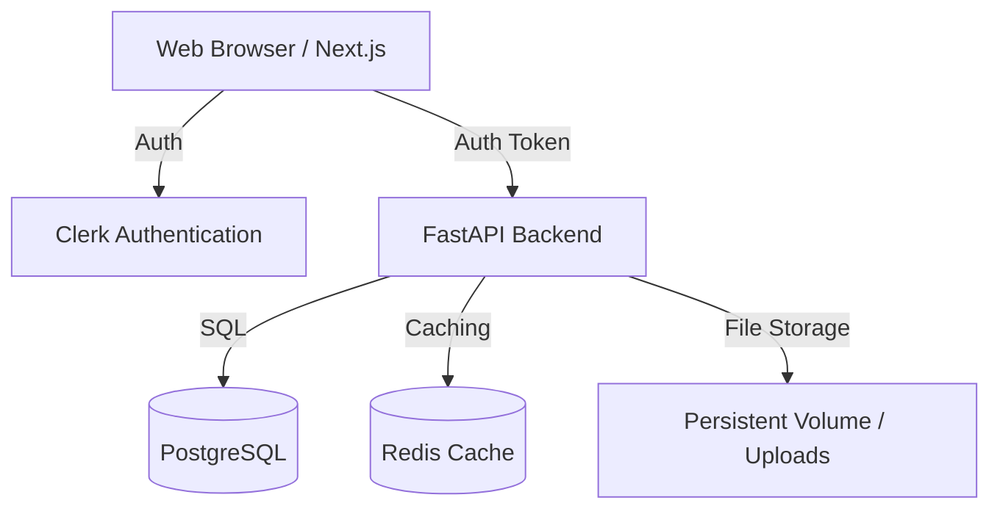
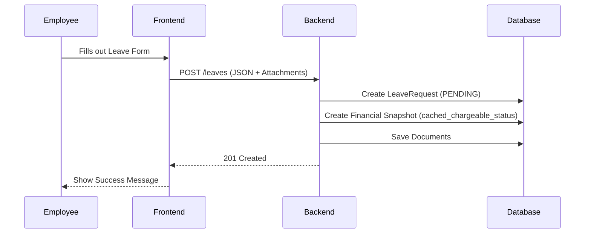
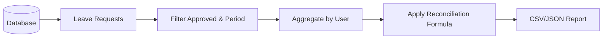

# System Architecture & Design

This document details the technical implementation of Leavey.

## System Overview

Leavey follows a standard 3-tier architecture with a decoupled frontend and backend.

### Components

- **Frontend**: A Next.js application providing a responsive user interface. It uses Clerk for secure authentication and Orval for generated API clients.
- **Backend**: A FastAPI server that handles business logic, database interactions, and file uploads.
- **Database**: PostgreSQL serves as the primary data store, managed via SQLModel.
- **Authentication**: Clerk manages user identities and provides JWT tokens for API authorization.
- **File Storage**: Local filesystem volumes are used to store uploaded documents associated with leave requests.

## Data Flow Diagrams

### Leave Request Submission Workflow

### Reconciliation Data Flow

## Reconciliation Logic

The reconciliation engine is the core financial component of Leavey. It calculates the billable days for contractors based on their approved leave and the "chargeable" status of those leaves.

### The Formula

The system calculates billable days for a specific period (usually a month) as follows:

$$ \text{Billable Days} = \text{Total Working Days} - \text{Non-Chargeable Leaves} $$

- **Total Working Days**: The potential days a contractor could have worked in the month (e.g., 22).
- **Non-Chargeable Leaves**: Leaves that the government does not reimburse (e.g., Unpaid Leave, Medical Leave beyond a certain limit).
- **Chargeable Leaves**: Leaves that are reimbursed (e.g., Annual Leave, Public Holidays). These **do not** reduce the billable days.

### Financial Snapshotting

> [!IMPORTANT]
> To ensure historical accuracy, Leavey uses **Financial Snapshotting** (Story FIN-003). 

When a leave request is created, the system snapshots the `is_chargeable` status of the category into `cached_chargeable_status`. If a manager later changes a category from "Chargeable" to "Non-Chargeable", older requests remain unaffected, preserving the integrity of previous financial reports.
